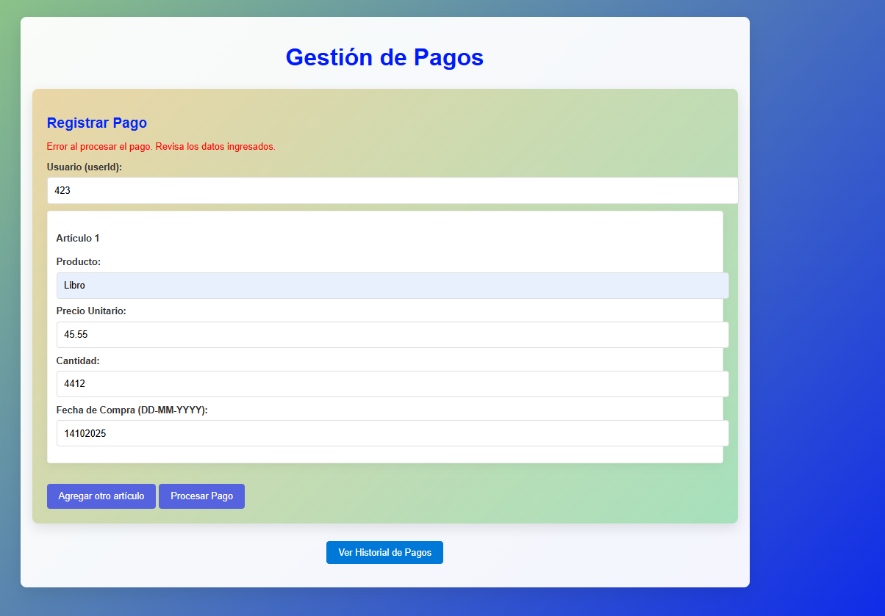
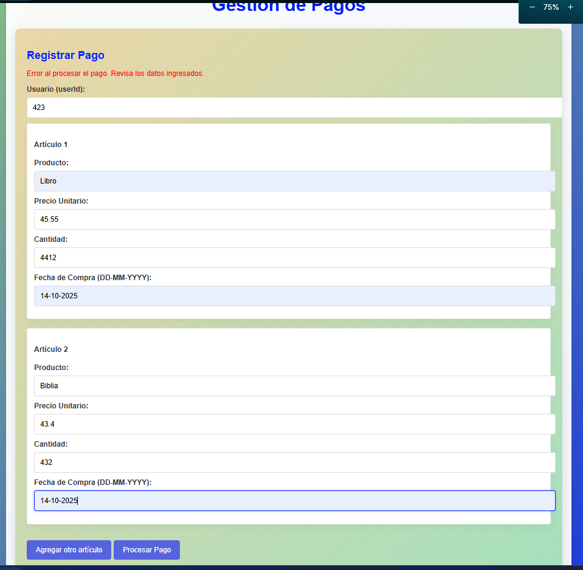

# 🖥️ ECICredit Frontend – React App para Gestión de Pagos

## 🎯 Descripción del Proyecto

Este es el frontend del MVP de ECICredit, una plataforma de pagos construida para permitir a los usuarios:

- Registrar pagos con múltiples artículos
- Consultar su historial de pagos
- Visualizar resultados con feedback claro e interactivo
- Disfrutar de una interfaz moderna, intuitiva y estilizada

Este cliente fue desarrollado en **React.js** y se conecta al backend desplegado en Azure a través de **Axios**, consumiendo una API RESTful.

---

## 🛠️ Tecnologías Utilizadas

| Herramienta        | Uso principal                           |
|--------------------|------------------------------------------|
| React.js           | Framework principal de UI                |
| Axios              | Cliente HTTP para llamadas al backend    |
| Styled Components  | Estilos modernos y encapsulados en JS    |
| JavaScript (ES6+)  | Lógica de componentes y hooks            |
| HTML + CSS         | Base de estructura visual                |

---

## 🔌 Conexión con Backend

La aplicación usa **Axios** para enviar y recibir información desde el backend en Spring Boot.

### Configuración de la URL del Backend

1. De manera local, es decir está embebido con la URL propia:
```env
API_BASE_URL="http://localhost:8080/api/payments"
```

2. En el código (por ejemplo en `PaymentForm.js` o `PaymentList.js`), las llamadas se hacen así:

```js
import axios from "axios";

const API_BASE_URL = "http://localhost:8080/api/payments";

axios.post(`${API_BASE_URL}/payments`, data);
axios.get(`${API_BASE_URL}/payments/${userId}`);
```

---

## 🚀 ¿Cómo ejecutar el proyecto localmente?

### Requisitos previos:

- Node.js 18+
- npm 9+

### Instrucciones:

```bash
git clone https://github.com/AnderssonProgramming/payment_process_rt.git
cd payment_process_rt
npm install
npm start
```

La app estará disponible en: [http://localhost:3000](http://localhost:3000)

---

## 🧩 Estructura de Componentes

```
/src
 ├── components
 │    ├── PaymentForm.js    ← Formulario para ingresar pagos
 │    ├── PaymentList.js    ← Lista interactiva de pagos del usuario
 │    └── PaymentItem.js    ← Tarjeta de detalle para cada pago
 ├── App.js                 ← Vista principal y control del estado
 └── index.js               ← Punto de entrada del renderizado
```

---

## ✨ Funcionalidades Clave

- [x] Registro de múltiples artículos en una transacción
- [x] Validación de fechas y campos requeridos
- [x] Cálculo de totales desde el backend (no manipulables desde el cliente)
- [x] Consulta de pagos por usuario
- [x] Visualización interactiva y estilizada
- [x] Reinicio del formulario tras cada pago exitoso
- [x] Componente de historial desplegable (botón toggle)

---

## 🖼️ Evidencias Visuales

- Registro exitoso de pago ✅
- Validación de errores ❌
- Vista del historial de pagos 📋






---

## 💡 Recomendaciones

- El backend debe estar corriendo (local o en Azure) para que las peticiones funcionen.
- Usa `npm run build` para crear la versión optimizada para producción.
- Puedes desplegar esta app fácilmente en Vercel, Netlify o Azure Static Web Apps.

---

## 🧑‍💻 Autor

Proyecto desarrollado por:  
*Andersson David Sánchez Méndez*  

Para el parcial de **CVDS - Segundo Tercio**
